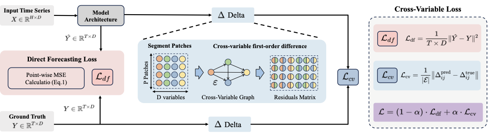

# CvLoss

Cross-Variable Loss (CvLoss) is a plug-in structural regularizer for multivariate time series forecasting. It augments the standard direct forecasting objective with residual consistency constraints over cross-variable forecast patches, encouraging the predicted future variables to preserve synchronous and asynchronous relationships.

This repository is an anonymous research release. Author names, affiliations, and contact information are intentionally omitted from project files.



## Documents

- Paper draft: [Doc/Cross_Variable_Loss.pdf](Doc/Cross_Variable_Loss.pdf)
- Framework diagram: [Doc/framework.pdf](Doc/framework.pdf)

## Repository Structure

```text
Doc/                    Paper draft and framework figure
Time-Series-Library/    Main experimental code with CvLoss-enabled objectives
iTransformer/           Adapted iTransformer experiments and scripts
TQNet/                  TQNet backbone experiments and ablations
PDF/                    PDF backbone experiments
CFPT/                   CFPT backbone experiments
TimeFilter/             TimeFilter backbone experiments
TimeBridge/             TimeBridge backbone experiments
baseline_results.py     Utility for summarizing recorded result files
search_config.py        Utility for parsing/searching add-loss experiments
*.log                   Recorded training logs
```

## Environment

The code follows the common PyTorch time-series forecasting stack. A minimal environment is:

```bash
conda create -n cvloss python=3.10
conda activate cvloss
pip install torch numpy pandas scikit-learn matplotlib einops tqdm PyWavelets
```

Some optional backbones may require additional packages. Install them only when running the corresponding model.

## Data

Datasets are not included in the repository. Place data under the dataset paths expected by the scripts, for example:

```text
Time-Series-Library/dataset/ETT-small/ETTh1.csv
Time-Series-Library/dataset/ETT-small/ETTh2.csv
Time-Series-Library/dataset/weather/weather.csv
Time-Series-Library/dataset/electricity/electricity.csv
Time-Series-Library/dataset/traffic/traffic.csv
```

The same layout is used by the adapted backbone folders when their scripts are run from that folder.

## Running CvLoss

The main CvLoss implementation is integrated into the long-term forecasting training loop in `Time-Series-Library/exp/exp_long_term_forecasting.py`. The key arguments are:

- `--add_loss`: `None`, `scv`, `stcv`, or `fcv`
- `--loss_patchlen`: patch granularity for the CvLoss graph
- `--alpha_add_loss`: weight for the direct forecasting loss
- `--beta_add_loss`: weight for CvLoss

Example single run:

```bash
cd Time-Series-Library
python -u run.py \
  --task_name long_term_forecast \
  --is_training 1 \
  --root_path ./dataset/ETT-small/ \
  --data_path ETTh1.csv \
  --model_id ETTh1_96_96_fcv \
  --model iTransformer \
  --data ETTh1 \
  --features M \
  --seq_len 96 \
  --label_len 48 \
  --pred_len 96 \
  --enc_in 7 \
  --dec_in 7 \
  --c_out 7 \
  --des Exp \
  --itr 1 \
  --add_loss fcv \
  --loss_patchlen 3 \
  --alpha_add_loss 0.5 \
  --beta_add_loss 0.5
```

## Experiment Scripts

Representative sweep scripts are provided under `Time-Series-Library/scripts_/`:

```bash
cd Time-Series-Library
bash scripts_/iTransformer/itransformer_cv.sh
bash scripts_/PatchTST/PatchTST_cv.sh
bash scripts_/DLinear/DLinear_cv.sh
```

Backbone-specific folders also contain scripts for their original and CvLoss-enhanced experiments.

## Results

Recorded metric files can be summarized with:

```bash
python baseline_results.py --file Time-Series-Library/cv_loss_iTransformer.txt --include-addloss
```

The parser expects result blocks in the format written by the training scripts:

```text
long_term_forecast_...
mse:<value>, mae:<value>
```
